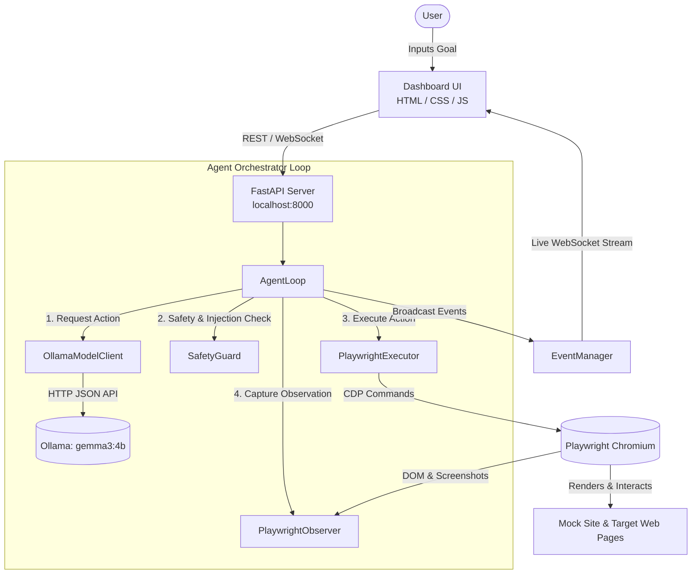
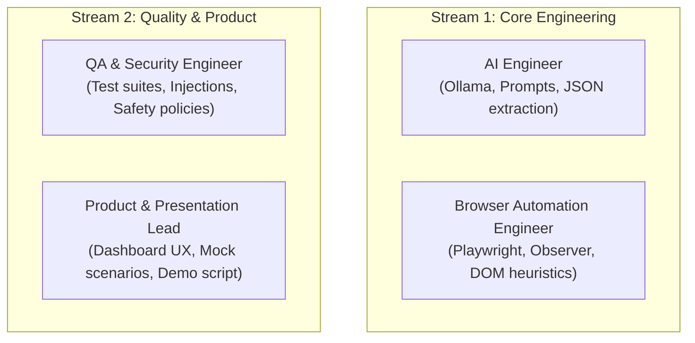

# BrowserPilot AI - System Architecture

BrowserPilot AI is a local-first, privacy-respecting autonomous browser agent. It pairs a local large language model (Ollama running **Gemma 3 4B**) with **Playwright Chromium** automation to achieve end-to-end web tasks.

---

## High-Level Architecture Diagram

---

## Modular Component Breakdown

| Module | Primary File | Responsibilities | Interface Contract |
| :--- | :--- | :--- | :--- |
| **API & Server** | `backend/app/main.py` | FastAPI app, REST routes, WebSocket server, static file host. | `GET /api/health` `POST /api/agent/start` `WS /ws/events` |
| **Schemas** | `backend/app/schemas.py` | Unified Pydantic v2 data models for observation, actions, and traces. | `PageObservation` `BrowserAction` `AgentResponse` |
| **Model Client** | `backend/app/model_client.py` | System prompt formatting, Ollama HTTP queries, structured JSON extraction. | `get_next_action(goal, obs)` |
| **Agent Loop** | `backend/app/agent_loop.py` | Autonomous step-by-step cycle coordinating model, safety, and execution. | `run(request: AgentRunRequest)` |
| **Observer** | `backend/app/observer.py` | Inspects DOM elements, accessibility nodes, and extracts visible viewport text. | `observe(page) -> PageObservation` |
| **Executor** | `backend/app/executor.py` | Chromium lifecycle, click, fill, navigate, scroll, and wait commands. | `execute(action) -> ExecutionResult` |
| **Safety Guard** | `backend/app/safety.py` | Flags destructive actions and detects indirect prompt injections in DOM. | `evaluate_action()` `inspect_observation()` |
| **Events** | `backend/app/events.py` | Real-time event broadcasting over WebSockets to client frontends. | `broadcast(event: AgentEvent)` |

---

## Four-Person Team Ownership Matrix

To enable parallel execution during the development cycle, responsibilities are partitioned as follows:

### 1. AI Engineer
- **Core Modules**: `backend/app/model_client.py`, prompt templates, JSON schema enforcement.
- **Deliverables**:
  - Optimize structured JSON output with `gemma3:4b`.
  - Implement few-shot examples and self-correction prompt logic when model generation fails.
  - Multi-step memory and plan revision strategies.

### 2. Browser Automation Engineer
- **Core Modules**: `backend/app/observer.py`, `backend/app/executor.py`.
- **Deliverables**:
  - Deterministic locator strategies (CSS, text-based, ARIA roles).
  - Resilient retry handling for dynamic/SPA DOM element hydration.
  - Viewport screenshots and bounding-box coordination.

### 3. QA & Security Engineer
- **Core Modules**: `backend/app/safety.py`, `backend/tests/`, security test suite.
- **Deliverables**:
  - Prompt-injection benchmark and injection evasion test cases.
  - Unit and integration tests covering schema validation and API endpoints.
  - Automated verification of destructive action blockers.

### 4. Product & Presentation Lead
- **Core Modules**: `dashboard/`, `mock-site/`, `docs/demo-script.md`.
- **Deliverables**:
  - Dashboard aesthetic refinements and responsive layouts.
  - Realistic mock site workflows (invoicing, tasks, settings).
  - Rehearsed, flawless demo narrative and presentation slides.
