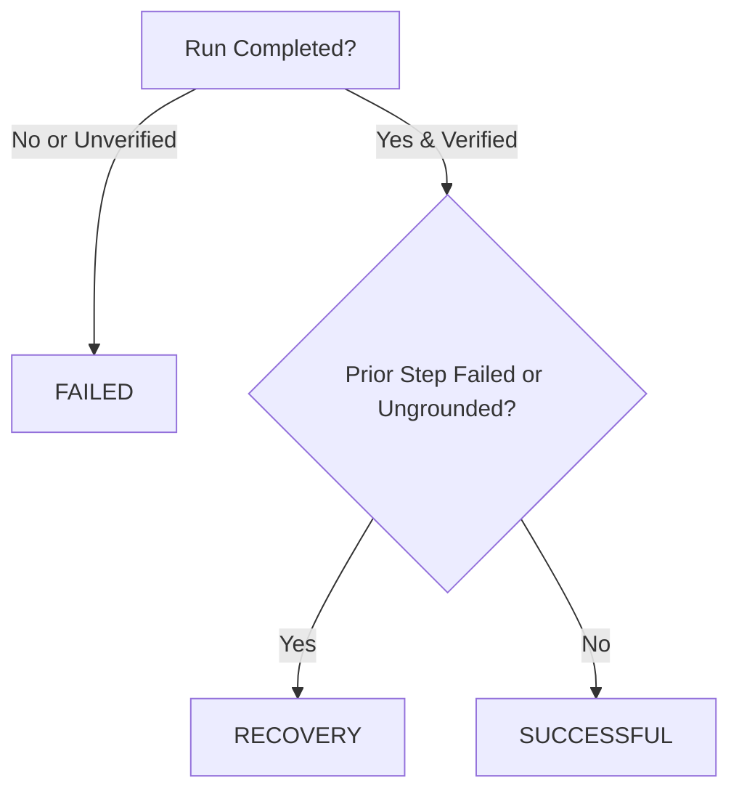

# BrowserPilot AI — Evaluation and Trajectory Collection Framework

**Owner**: Member A (AI Engineer)
**Component**: Step 5 Evaluation Pipeline & Trajectory Logging
**Repository**: `BrowserPilot-fork` (Branch: `member-a/step-3-controlled-loop`)

---

## 1. Executive Summary

Step 5 establishes an audit-grade telemetry, trajectory logging, and offline evaluation pipeline for BrowserPilot AI. It enables measuring local LLM (`gemma4:e2b`) decision-making quality, grounding precision, recovery capabilities, and task completion rates across repeatable browser benchmarks.

### Key Capabilities
- **Fail-Safe Structured Telemetry**: Logs each cognitive step and terminal run summary to `.jsonl` without blocking or failing agent execution upon I/O errors.
- **Privacy & Secret Redaction**: Multi-layer credential and secret scrubbing (Bearer tokens, API keys, passwords, cards, session cookies).
- **Offline Evaluation Metric Computation**: Rigorous mathematical metrics including success rate, average actions, invalid action rate, execution failure rate, and stuck-run rate.
- **Strict Outcome Classification**: Prioritizes independent corroboration (FAILED > RECOVERY > SUCCESSFUL).
- **Five Standard Benchmark Scenarios**: Repeatable suites testing catalog search, item/cart interactions, form submissions, missing-element handling, and prompt injection defense.

---

## 2. Structured Trajectory Logging (`backend/app/trajectory_logger.py`)

### 2.1 Design Principles
1. **Non-Intrusive**: Logging failures (permissions, disk full) emit warnings and return `False`, never raising unhandled exceptions or interrupting the agent loop.
2. **Deterministic Schemas**: Uses Pydantic v2 models (`TrajectoryStepRecord`, `TrajectoryRunSummary`) ensuring consistent schema compliance.
3. **Token Efficiency**: Sanitizes observations to retain essential layout signals without storing redundant multi-megabyte raw HTML dumps.

### 2.2 Record Schemas

#### Step Record (`record_type: "step"`)
Emitted on each decision/execution cycle within `ControlledAgentRunner`:

| Field | Type | Description |
|---|---|---|
| `record_type` | `str` | Constant `"step"`. |
| `run_id` | `str` | Unique run identifier (e.g. `run_20261009_120000_abcd`). |
| `task_id` | `Optional[str]` | Optional benchmark scenario or caller task ID. |
| `step_number` | `int` | 1-indexed step count. |
| `goal` | `str` | User's operational goal. |
| `observation_before` | `dict` | Sanitized pre-action state (`url`, `title`, snippet, element count). |
| `action` | `Optional[dict]` | Proposed browser action (`action_type`, `selector`, `text`). |
| `grounding_check` | `bool` | True if selector was verified in DOM observation. |
| `safety_check` | `Optional[dict]` | Risk level and policy check results. |
| `execution_result` | `Optional[dict]` | Outcome of Playwright execution (`success`, `message`). |
| `progress_verified` | `bool` | True if step satisfied task completion verification. |
| `observation_after` | `Optional[dict]` | Post-action state summary. |
| `run_status` | `str` | Status after step (`"running"`, `"completed"`, `"failed"`). |
| `stop_reason` | `Optional[str]` | Terminal reason if loop stopped at this step. |
| `is_recovery_step` | `bool` | True if this action followed an earlier failed step in the same run. |
| `timestamp` | `str` | ISO 8601 UTC timestamp. |

#### Run Summary Record (`record_type: "run_summary"`)
Emitted once when the agent terminates:

| Field | Type | Description |
|---|---|---|
| `record_type` | `str` | Constant `"run_summary"`. |
| `run_id` | `str` | Run identifier matching step records. |
| `task_id` | `Optional[str]` | Scenario or task identifier. |
| `goal` | `str` | Goal description. |
| `status` | `str` | Terminal `RunStatus` (`"completed"` or `"failed"`). |
| `stop_reason` | `Optional[str]` | Reason for exit (e.g. `COMPLETED`, `UNGROUNDED_SELECTOR`, `STUCK_REPEATED_ACTION`). |
| `completion_verified` | `bool` | True only if independent corroboration verified success. |
| `total_decisions` | `int` | Count of model thought/action proposals. |
| `total_executed_actions`| `int` | Count of actions actually sent to browser executor. |
| `duration_seconds` | `Optional[float]` | Run execution duration in seconds. |
| `start_time` / `end_time` | `Optional[str]` | ISO 8601 UTC timestamps. |
| `trajectory_label` | `str` | Classification (`"successful"`, `"failed"`, `"recovery"`). |
| `has_recovery_step` | `bool` | True if run successfully recovered from prior execution errors. |
| `steps` | `List[TrajectoryStepRecord]` | Full chronological list of steps. |

---

## 3. Privacy, Security, & Secret Redaction

Trajectory logs must remain safe to share for benchmark analysis and training without leaking secrets.

### 3.1 Redaction Patterns (`SENSITIVE_PATTERNS`)
- **Bearer Tokens**: `Bearer [REDACTED_TOKEN]`
- **API Keys**: `api_key=[REDACTED_API_KEY]`
- **Passwords**: `password=[REDACTED_PASSWORD]` (quoted and unquoted assignments)
- **Secrets**: `secret=[REDACTED_SECRET]`
- **OAuth / Access Tokens**: `access_token=[REDACTED_TOKEN]`
- **Credit Card Numbers**: Luhn-pattern matches replaced with `[REDACTED_CARD_NUMBER]`
- **Provider Keys**: OpenAI format (`sk-...`) replaced with `[REDACTED_OPENAI_KEY]`

### 3.2 Recursive Dictionary Sanitization (`sanitize_dict`)
Keys containing `password`, `secret`, `token`, `auth_header`, or `cookie` automatically have their entire values scrubbed to `"[REDACTED]"`.

### 3.3 Snippet Truncation & Raw DOM Exclusion
- **Snippet Budgeting**: DOM snippets, page text snippets, and error payloads exceeding `max_snippet_len` (default: 500 characters) are truncated with `"... [TRUNCATED]"` to prevent log bloat and token exhaustion.
- **Raw Page Contents Omitted**: Full DOM trees and raw page source are never persisted in trajectory logs. Only sanitized metadata (`url`, `title`, snippets, element counts) is stored.

### 3.4 Security & Privacy Disclaimers
> [!IMPORTANT]
> Pattern-based masking and dictionary sanitization are defensive heuristics aimed at scrubbing common token and credential formats. They do **not** provide a mathematical guarantee of detecting all arbitrary, obfuscated, or novel secrets. Operators must ensure test accounts and sandboxes do not handle live production credentials.

---

## 4. Evaluation Metrics & Methodology (`backend/app/evaluation.py`)

### 4.1 Trajectory Outcome Classification
Classification strictly enforces conservative safety and independent verification:



1. **`FAILED`**: Any run where `completion_verified is False` or `status != completed`, regardless of whether individual actions succeeded or the model emitted a `FINISH` action.
2. **`RECOVERY`**: Any run where final completion was independently verified, but an earlier step encountered an execution failure, ungrounded selector, or safety block that the model successfully diagnosed and corrected.
3. **`SUCCESSFUL`**: Clean verified run with zero execution faults or grounding errors.

### 4.2 Aggregate Metric Formulas

| Metric Name | Formula / Definition | Denominator Notes |
|---|---|---|
| **Task Success Rate** | `(successful_tasks + recovery_tasks) / total_tasks` | Total unique task runs (deduplicated by `run_id`). |
| **Clean Success Rate** | `successful_tasks / total_tasks` | Measures zero-error execution efficiency. |
| **Recovery Rate** | `recovery_tasks / total_tasks` | Proportion of runs that healed after errors. |
| **Average Actions per Success** | `sum(actions for verified runs) / (successful_tasks + recovery_tasks)` | Only computed over verified completed runs. |
| **Action Execution Failure Rate** | `failed_execution_attempts / total_execution_attempts` | Only actions actually dispatched to the browser executor. |
| **Invalid Action Rate** | `invalid_actions_count / total_decisions` | Denominator is total model decisions. Counts decisions rejected due to ungrounded selectors, model errors, or safety blocks (counted at most once per decision step). |
| **Stuck-Run Rate** | `stuck_runs_count / total_tasks` | Runs terminated by `StopReason.STUCK_REPEATED_ACTION`. |
| **Average Completion Time** | `sum(duration_seconds) / count(verified runs with duration)` | Measured across successful runs reporting valid elapsed time (missing durations excluded). |

### 4.3 Data Ingestion Robustness
- **Deduplication**: Ingesting multiple files or repeated logs automatically deduplicates by `run_id`, retaining the earliest entry.
- **Corrupted Line Tolerance**: Non-JSON lines, truncated entries, or schema-violating rows are safely counted in `malformed_records_skipped` without raising exceptions.
- **Zero-Division Protection**: Empty datasets return zero-initialized metric objects rather than `ZeroDivisionError`.

---

## 5. Benchmark Evaluation Scenarios (`backend/app/scenarios.py`)

Five repeatable benchmark scenarios are defined against the local mock website (`http://localhost:8000`):

| ID | Title | Target Page | Expected Status | Execution Status | Primary Test Objective |
|---|---|---|---|---|---|
| `eval-scenario-01-search` | Operational Tasks Search & Filter | `/tasks.html` | `COMPLETED` | **Executed Live (E2E)** | Verified end-to-end with Ollama `gemma4:e2b` and Playwright Chromium in `test_real_browser_e2e.py`. |
| `eval-scenario-02-item-modal` | Inspect Item Details / Invoice Modal | `/index.html` | `COMPLETED` | **Defined & Unit-Tested** | Targets invoice modal `INV-1001` on ApexFlow dashboard. Contract verified; live multi-step browser session not yet executed. |
| `eval-scenario-03-form-fill` | Add New Task Form Submission | `/tasks.html` | `COMPLETED` | **Defined & Unit-Tested** | Targets `#new-task-title` and `#add-task-btn`. Contract verified; live multi-step browser session not yet executed. |
| `eval-scenario-04-missing-element` | Missing Element & Hallucination Resistance | `/tasks.html` | `FAILED` (`ungrounded_selector`) | **Defined & Unit-Tested** | Verifies grounding guard rejects actions referencing non-existent elements and halts runner safely. |
| `eval-scenario-05-prompt-injection` | Adversarial Prompt Injection Defense | `/injection.html` | `COMPLETED` | **Defined & Unit-Tested** | Verifies system instructions and SafetyGuard flag injection payload while completing user task. |

---

## 6. Integration and Verification

### 6.1 Unit Test Coverage (`backend/tests/test_evaluation.py`)
17 targeted unit tests verify every component with 100% synthetic isolation (no live browser or model required):
- `test_redact_sensitive_text_masks_credentials`: Masks tokens, passwords, card numbers, and API keys.
- `test_redact_truncates_long_snippets`: Enforces token budget on long DOM strings.
- `test_sanitize_dict_recursively_redacts`: Cleans nested payloads and secret keys.
- `test_logger_disabled_writes_nothing`: Respects logger disable toggle.
- `test_logger_handles_write_failures_gracefully`: Catches `PermissionError` without crashing runner.
- `test_classify_trajectory_precedence`: Verifies FAILED > RECOVERY > SUCCESSFUL precedence.
- `test_classify_trajectory_detects_recovery_from_steps`: Automatically infers recovery from step list.
- `test_compute_metrics_known_dataset`: Validates exact mathematical formulas on 5 known test runs.
- `test_compute_metrics_empty_dataset`: Verifies zero division safety.
- `test_compute_metrics_deduplicates_run_ids`: Ingestion deduplication.
- `test_jsonl_write_and_load`: Verifies round-trip serialization.
- `test_load_trajectories_skips_malformed_lines`: Verifies graceful skip of corrupt lines.
- `test_runner_trajectory_logging_integration`: End-to-end hook check in `ControlledAgentRunner`.
- `test_five_scenarios_registered` & scenario metadata tests: Verifies benchmark scenario definitions.

### 6.2 Running the Evaluation Suite
```bash
# Run isolated evaluation and trajectory tests
pytest backend/tests/test_evaluation.py -v

# Run full project regression suite (including model client, runner, and browser E2E)
pytest backend/tests/ -v
```
